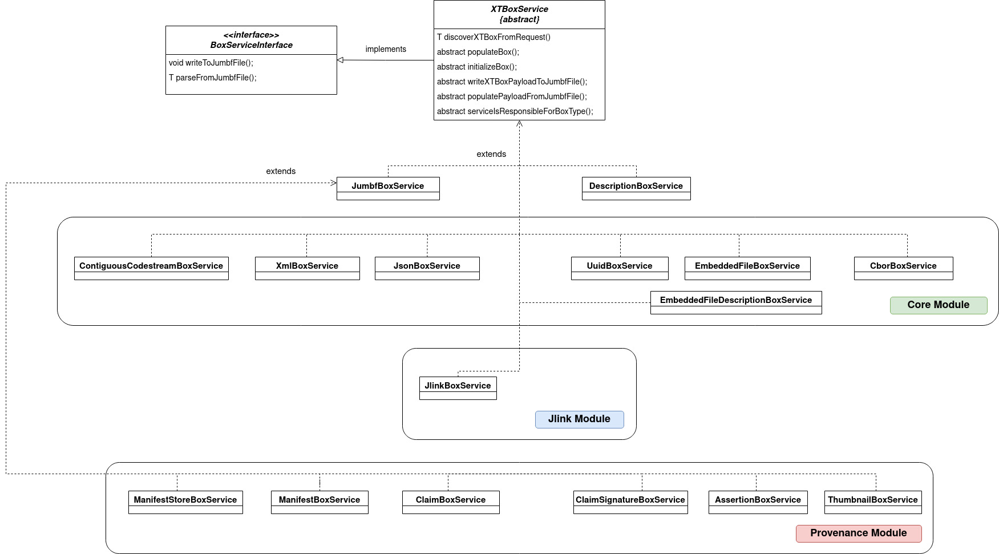

# Demo JUMBF application

## Table of Contents

1. [Introduction](#intro)
2. [Requirements](#requirements)
3. [How to Deploy](#deployment)
3. [Demo](#demo)
4. [Application structure and terminology](#spring)


## Introduction <a name="intro"></a>

This demo application proposes a design on how to parse metadata that are stored/structured following the JPEG Universal Metadata Box Format (JUMBF) defined in Part 5 JPEG Standard. Ideally, the goal of this design is to support the maintenance effort of the JUMBF functionalities as well as to provide an interface for additional modules(i.e. JLINK, Privacy and Security, Provenance) to extend these functionalities according to their application needs.

Specifically, the application provides two Rest endpoints that demonstrate the following operations:

1. Parse a file that stores JUMBF metadata wrapped with the binary structure (XTBox) proposed by JPEG-1 / JPEG XT. The GET response is a string containing information about the JUMBF structure.

2. Generate JUMBF file based on information provided in the POST request body. The POST response is a string showing the location where the JUMBF file is stored.

The goal of this demo is to create a proof of concept application which shows that this design could support the effort of creating a modular ecosystem as well as show how an additional application - i.e. provenance module - can extend the functionality implemented in the core JUMBF module. Regarding the provenance module, we show how a new box definition called "AssertionBox" can extend the functionality of a JUMBF box as described in the core layer. 

## Installation <a name="requirements"></a>

The demo was developped using the following tools:

* Java 11
* Apache Maven 3.6.3
* Spring boot 2.6.4

**Note:** It is useful to have a REST Client to test the REST endpoints.

## Deploying <a name="deployment"></a>

In the home directory of the project there are two directories core and provenance each one corresponding to a separate application. Provenance application is dependent on core application. Let's first focus on the core module. In the core/src/main/resources/application.parameters you may find the parameters that can be configured for the core application. It is important to specify the path where the images and jumbf files (files with extension .jumbf) should be stored. For documentation purposes below you may find all the parameters used for the demo:

``` 
spring.main.allow-circular-references=true

logging.level.org.mipams.jumbf.core=DEBUG 

# Maximum size per file uploaded: 50 MB
org.mipams.core.max_file_size_in_bytes=52428800

org.mipams.core.image_folder=/home/nikos/Desktop

```

Now, let's compile the application. In the application's home directory run the following command:

```
mvn clean package
```

This will produce the respective jars in each of the projects. In core/target directory we shall find two jar files. The first one is marked as exec which allows us to run the core module as a standalone application. The second jar is not executable and can be placed as a dependency to other modules. In provenance/target directory we shall find one executable jar file to run the provenance application. For the first part of the demo we will show the core functionalities. Thus, we launch the core module as a standalone application using the following command:

```
java -jar core/target/jumbf-core-0.0.1-SNAPSHOT-exec.jar
```

Providing that all the steps were executed with no error, the following message should be displayed in the terminal:

```
org.mipams.jumbf.core.JumbfApplication       : Application is up and running
```

The application runs on port 8080.

## Demo <a name="demo"></a>

Now that the application is up and running, let's use the Rest API to test our functionality. 

### Generate a JUMBF file
Firstly, let's request the generation of a JUMBF file containing our metadata which is the JSON {"test-label": "test-value" } . We can use the Rest Client of our reference and perform a POST request in the following URL:

```
http://localhost:8080/core/v1/generateBox
```

The body of this request should be the following JSON document describing the JUMBF structure that we want to generate:

```
{
    "type": "jumb",
    "description":
    {
    	"type": "jumd",
        "contentType": "json",
        "label": "This is an example JUMBF metadata format"
    },
    "contentList":
    [
        {
            "type": "json",
            "fileUrl":"/home/nikos/Desktop/test.json"
        }
    ]
}
```

The above JSON format describes a jumbf box with one description box (by definition) and one content box of type JSON. 

Provided that the request is well-formed, the POST request is a string  corresponding to the path where the .jumbf file is stored.

Let's see a more complicated example where we can specify metadata consisting of three type of content boxes: A JSON, a XML and a Contiguous Codestream (Image file) Box. Below you can see the Request body that needs to be sent through the aforementioned URI:

```
{
    "type": "jumb",
    "description": {
        "type": "jumd",
        "contentType": "jumb",
        "label": "Superbox containing three children boxes"
    },
    "contentList": [
        {
            "type": "jumb",
            "description": {"type": "jumd", "contentType":"json","label":"Box containing the JSON metadata"},
            "contentList": [{"type":"json","fileUrl":"/home/nikos/Desktop/test.json"}]
        },
        {
            "type": "jumb",
            "description": {"type": "jumd", "contentType":"jp2c","label":"Box containing the Contiguous Codestream metadata"},
            "contentList": [{"type":"jp2c","fileUrl":"/home/nikos/Desktop/test.jpeg"}]
        },
        {
            "type": "jumb",
            "description": {"type": "jumd", "contentType":"xml","label":"Box containing the Contiguous Codestream metadata"},
            "contentList": [{"type":"xml","fileUrl":"/home/nikos/Desktop/test.xml"}]
        }
    ]
}
```

Example to define a Embedded File Jumbf Box is shown below:

```
{
  "type": "jumb",
  "description": {
    "type": "jumd",
    "contentType": "bfbd",
    "label": "This is an example JUMBF metadata format"
  },
  "contentList": [
    {
      "embeddedFileDescription": {
        "type": "bfdb",
        "mediaType": "image/jpeg",
        "fileName": "test.jpeg",
        "fileExternallyReferenced": "true"
      },
      "content": {
        "type": "bidb",
        "fileUrl": "http://example.org/test.png"
      }
    }
  ]	
}
```

Example to define a UUID Jumbf Box is shown below:

```
{
  "type": "jumb",
  "description": {
    "type": "jumd",
    "contentType": "uuid",
    "label": "This is an example JUMBF metadata format"
  },
  "contentList": [
    {
      "type": "uuid",
      "uuid": "645ba7a8-b7f4-11ec-b909-0242ac120002",
      "fileUrl": "/home/nikos/file.enc"
    }
  ]	
}
```

### Parse a JUBMF file
Now that we have generated one JUMBF file, let's parse it and see its contents. For this, we need to execute the following GET request in the URL:

```
http://localhost:8080/core/v1/parseMetadata?path=/home/nikos/Desktop/test.jumbf
```

Provided that the JUMBF file is well-formed, the GET response shall be a brief string describing the structure of the parsed file. An example of this description is depicted below:

```
JumbfBox(descriptionBox=DescriptionBox(uuid=6a736f6e-0011-0010-8000-00aa00389b71, toggle=2, label=This is an example JUMBF metadata format, id=null, signature=null), contentList=[JsonBox(jsonContent={"test":1})])
```

### Provenance module "extending" core module

Now we will validate that indeed the core module can be injected as a library in the provenance module. Provided that we have stopped the application from the previous demo, we can launch the provenance application by executing the following command:

```
java -jar provenance/target/jumbf-provenance-0.0.1-SNAPSHOT.jar
```

For this demo we have implemented a simple "test" GET request to showcase that the AssertionBoxService (which extends the JumbfBoxService defined in the core module) is instantiated properly.

If we need to execute the following GET request in the URL:

```
http://localhost:8080/provenance/v1/test
```

The response is a simple message specifying that the class has been successfully instantiated:

```
I connected one package with another. The box with id: 1836081523 is discovered properly.
```

## Application structure and terminology <a name="spring"></a>

The whole JUMBF application (not only the one that appears on the demo) could be logically separated in independent layers each of whom is responsible for a specific application over JUMBF metadata. All these layers are strongly dependent on **core layer** which implements the basic JUMBF box definitions. Each layer can be defined in a separate package inside the jumbf package. In the jumbf package we could contain not only the core layer but also all the layers related to any application that needs to parse application-specific JUMBF boxes.

In this design, the two main abstractions of a layer are the *entities* and the *services*. Each service is mapped to a specific entitity. An **entitity** describes the structure (i.e. fields) of its corresponding Box definition while a **service** defines all the necessary functionalities that need to be performed in this specific box. The following diagram describes the relationship of the services that need to be defined in the core module. Notice that the two important methods that any service shall implement (BoxServiceInterface.java) is how to parse metadata from a JUMBF file and how to write in it. In this demo we added a third method, discoverXTBoxFromRequest in XTBoxService.java, which defines a way to instantiate a JUMBF structure from a json request (i.e. through a REST request). 

In the following diagram you may see the dependencies between the Services of different layers (i.e. Core, JLink, Provenance) as well as the important methods that are defined as abstract in the XTBoxService. This "obliges" the children classes to implement these functionalities.



The second diagram illustrates the entities structures. In addition, we can also observe the fields that are defined for the boxes that are implemented in the core module in scope of this demo. JLink and Provenance modules are depicted to show the extensibility of of the classes. 


The *XTBoxService* contains all the functionalities related to parsing JPEG XT Box headers. Notice that it's defined as an abstract class meaning that there is no way that a box object can be solely a XTBoxService. Since each service extends the XTBoxService, these functionalities are inherited for any service in any layer which allows for code reusability. *This means that if we want to define a new box in a layer we need to define three things: 1) the structure of the new box in a new entity 2) the functionalities to parse and generate a jumbf box containing that type of box (i.e. a new service) and 3) the definition of the corresponding UUID uniquely identifying this type of box in acrosss all the layers (this is done in the enums "BoxTypeEnum" and ContentTypeEnum".*

### Implementing a BoxService
A box is considered as a plain object (i.e entity) and all the functionalities are described in each corresponsing service. A service is implemented as a Spring Bean. This allows us to easily discover the correct BoxService class that needs to be called depending on the type of box that we want to process. 
