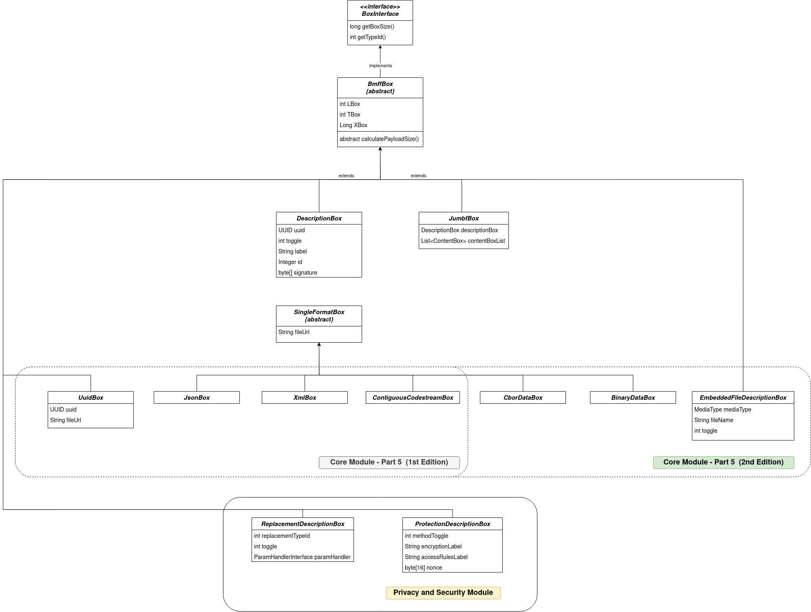

[](https://github.com/nickft/mipams-jumbf/actions/workflows/maven.yml?branch=main)
[](https://github.com/nickft/mipams-jumbf/actions/workflows/maven.yml)
[](https://github.com/nickft/mipams-jumbf/actions/workflows/maven.yml)

# JUMBF Reference software

## Table of Contents

1. [Introduction](#intro)
2. [Requirements](#requirements)
3. [How to Deploy](#deployment)
4. [Demo](#demo)
5. [Application structure and terminology](#spring)


## Introduction <a name="intro"></a>

This demo application proposes a design on how to parse metadata that are stored/structured following the JPEG Universal Metadata Box Format (JUMBF) defined in Part 5 JPEG Standard. Ideally, the goal of this design is to support the maintenance effort of the JUMBF functionalities as well as to provide an interface for additional modules(i.e. JLINK, Privacy and Security, Provenance) to extend these functionalities according to their application needs.

Specifically, the application provides two Rest endpoints that demonstrate the following operations:

1. Parse a file that stores JUMBF metadata wrapped with the binary structure (XTBox) proposed by JPEG-1 / JPEG XT. The GET response is a string containing information about the JUMBF structure.

2. Generate JUMBF file based on information provided in the POST request body. The POST response is a string showing the location where the JUMBF file is stored.

The goal of this demo is to create a proof of concept application which shows that this design could support the effort of creating a modular ecosystem as well as show how additional JUMBF definitions - i.e. Privacy & Security module - can extend the functionality implemented in the core JUMBF module. Currently the following standards are implemented:

1. JPEG systems — Part 5: JPEG Universal Metadata Box Format (Status: On going)
2. JPEG systems — Part 4: Privacy and security (Status: Completed)

## Installation <a name="requirements"></a>

The application was developped using the following tools:

* Java 11
* Apache Maven 3.6.3
* Spring boot 2.6.4

**Note:** It is useful to have a REST Client to test the REST endpoints.

## Deploying <a name="deployment"></a>

In the home directory of the project there are two directories core (corresponding to JUMBF) and privsec (corresponding to Privacy & Security) each one corresponding to a separate application. Privacy & Security application is dependent on core application. Let's first focus on the core module. 

To compile the entire project. Run the following command in the home directory:

```
mvn clean package
```

This will produce the executable jars in all the submodules. 

## Demo <a name="demo"></a>
In the "example" directory you can find a demo application which shows how to use the mipams library. For more information visit the "example" directory.

## Application structure and terminology <a name="spring"></a>

The whole JUMBF application (not only the one that appears on the demo) could be logically separated in independent layers each of whom is responsible for a specific application over JUMBF metadata. All these layers are strongly dependent on **core layer** which implements the basic JUMBF box definitions. Each layer can be defined in a separate package inside the jumbf package. In the jumbf package we could contain not only the core layer but also all the layers related to any application that needs to parse application-specific JUMBF boxes.

In this design, the two main abstractions of a layer are the *entities* and the *services*. Each service is mapped to a specific entitity. An **entitity** describes the structure (i.e. fields) of its corresponding Box definition while a **service** defines all the necessary functionalities that need to be performed in this specific box. Any service that implements the BoxService interface shall implement three core methods: getServiceMetadata(), writeToJumbfFile() and parseFromJumbfFile(). For debugging and testing purposes we added a forth method, discoverBoxFromRequest, which defines a way to instantiate a JUMBF structure from a json request (i.e. through a REST request). 

The following diagram illustrates the entities structures. Privacy & Security module is depicted to show the extensibility of the classes. 



### Implementing a BoxService
A box is considered as a plain object (i.e entity) and all the functionalities are described in each corresponsing service class. A service is implemented as a Spring Bean. This allows us to easily discover the correct BoxService class that needs to be called depending on the type of box that we want to process. 
