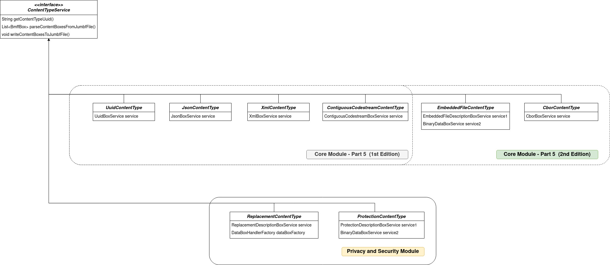

[](https://github.com/nickft/mipams-jumbf/actions/workflows/maven.yml?branch=main)

# JPEG Systems Reference software

## Table of Contents

1. [Introduction](#intro)
2. [Requirements](#requirements)
3. [How to Deploy](#deployment)
4. [Demo](#demo)
5. [Application structure and terminology](#spring)


## Introduction <a name="intro"></a>

The MIPAMS JPEG Systems library is a multimodule project written in Java which provides the interfaces to model, parse and generate JUMBF data according to the ISO/IEC 19566 standards. Currently the following standards are implemented:

1. JPEG systems — Part 5: JPEG Universal Metadata Box Format
2. JPEG systems — Part 4: Privacy and security

## Installation <a name="requirements"></a>

The application was developped using the following tools:

* Java 11
* Apache Maven 3.6.3
* Spring boot 2.6.4

**Note:** It is useful to have a REST Client to test the REST endpoints.

## Deploying <a name="deployment"></a>

In the home directory of the project there are two directories core (corresponding to JUMBF) and privsec (corresponding to Privacy & Security) each one corresponding to a separate application. Privacy & Security application is dependent on core application. Let's first focus on the core module. 

To compile the entire project. Run the following command in the home directory:

```
mvn clean package
```

This will produce the executable jars in all the submodules. 

## Demo <a name="demo"></a>
In the "example" directory you can find a demo application which shows how to use the mipams library. For more information visit the "example" directory.

## Application structure and terminology <a name="spring"></a>

The entire MIPAMS JPEG Systems application (not only the one that appears on the demo) could be logically separated in independent layers each of whom is responsible for a specific application over JUMBF metadata. All these layers are strongly dependent on **jumbf layer** which implements the basic JUMBF data model. Each layer can be defined in a separate package inside the org.mipams package. In this package we could contain not only the core layer but also all the layers related to any application that needs to parse application-specific JUMBF boxes.

In this design, the two main abstractions of a layer are the *entities* and the *services*. Each service is mapped to a specific entitity. An **entitity** describes the structure (i.e. fields) of its corresponding Box definition while a **service** defines all the necessary functionalities that need to be performed in this specific box. Any service that implements the BoxService interface shall implement three core methods: getServiceMetadata(), writeToJumbfFile() and parseFromJumbfFile().

The following diagram illustrates the entities structures. Privacy & Security module is depicted to show the extensibility of the classes. 


Finally, we need to define the JUMBF Box Content Types. A Content Type is defined based on the Content Type UUID that is defined in the JUMBF box's Description box. A ContentType class is a service which defines the way to parse/generate the Content Boxes (it could be more than one content boxes) that are specified in a Content Type JUMBF Box according to the standard.




### Implementing a BoxService
A box is considered as a plain object (i.e entity) and all the functionalities are described in each corresponsing service class. A service is implemented as a Spring Bean. This allows us to easily discover the correct BoxService class that needs to be called depending on the type of box that we want to process. 
